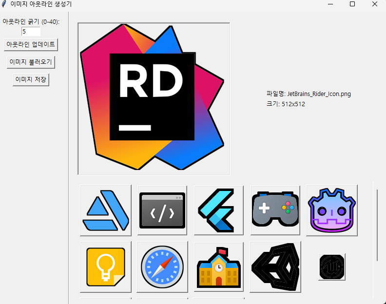

# 이미지 아웃라인 생성기


이 프로그램은 GUI 기반의 이미지 아웃라인 생성 도구입니다. 사용자가 선택한 이미지에 아웃라인을 추가하고 결과를 저장할 수 있습니다.

## 주요 기능

- 여러 이미지 불러오기 및 관리
- 아웃라인 굵기 조절 (0-40 픽셀)
- 실시간 아웃라인 미리보기
- 처리된 이미지 저장
- 썸네일 그리드 뷰 및 메인 이미지 표시
- 선택한 이미지의 파일명과 크기 정보 표시

## 설치 방법

1. 이 저장소를 클론합니다:
   ```
   git clone https://github.com/Mossworm/image_outliner.git
   ```

2. 필요한 라이브러리를 설치합니다:
   ```
   pip install -r requirements.txt
   ```

## 사용 방법

1. 프로그램을 실행합니다:
   ```
   python image_outliner.py
   ```

2. "이미지 불러오기" 버튼을 클릭하여 처리할 이미지를 선택합니다.
3. 아웃라인 굵기를 조절합니다 (0-40 사이의 값).
4. "아웃라인 업데이트" 버튼을 클릭하여 변경사항을 적용합니다.
5. 썸네일 그리드에서 이미지를 선택하여 큰 미리보기를 확인합니다.
6. "이미지 저장" 버튼을 클릭하여 처리된 이미지를 저장합니다.

## 요구 사항

- Python 3.x
- tkinter
- Pillow (PIL)
- numpy

## 라이선스

이 프로젝트는 MIT 라이선스 하에 배포됩니다. 자세한 내용은 [LICENSE](LICENSE) 파일을 참조하세요.

## 기여

버그 리포트, 기능 제안 또는 풀 리퀘스트는 언제나 환영합니다. 프로젝트에 기여하고 싶으시다면 이슈를 열거나 풀 리퀘스트를 보내주세요.
